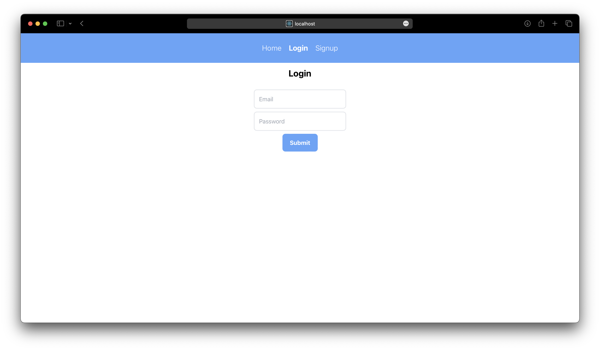
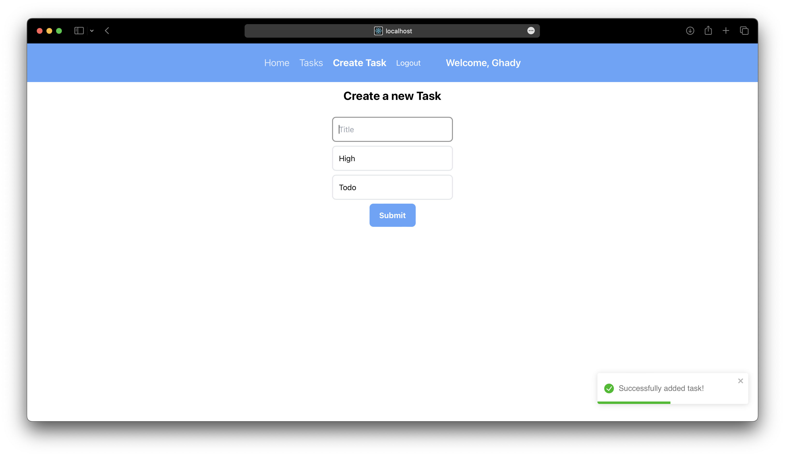
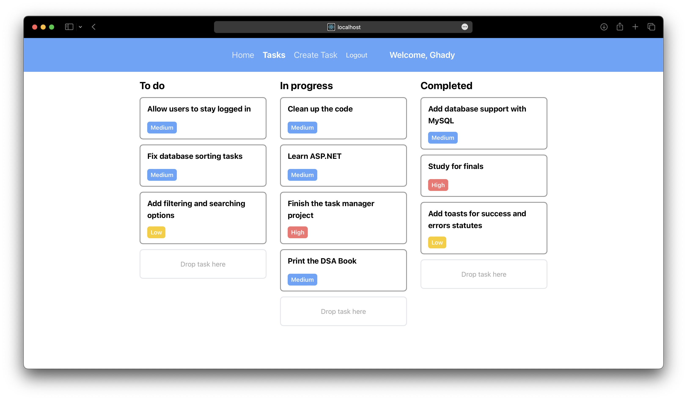

# Task Manager App

### About the project

This is a task manager app that allows you to set your tasks and manage them according to their current status.

#### Features implemented

- Create tasks, and edited them after they have been created.
- Delete existing tasks when they aren't relevant anymore.
- Create your own account, to save your tasks on the backend server.
- Simple UI that allows you to drap and drop the tasks to their current status _(e.g. Todo, In Progress, Completed)_

### Tech stack used

The project is built using **React.js** for the front end client side and styled using **TailwindCSS**.

The API is built using **C#** & **ASP.NET**.

#### Additional libraries

The drag and drop feature was implemented using `react-dnd` and the toasts that show on either successful or failed operations is implemented using `react-toastify`.

### Getting started

1. Clone the repository

```
git clone https://github.com/Ghaadyy/task-manager-react
```

2. Install all the dependencies

```
npm install
```

3. Create a `.env` file inside the root directory and create the enviroment variables

```
REACT_APP_API_URL = <the_api_url_here>
```

4. Run the backend API and the client using

```
npm run start
```

The client should run on `http://localhost:3000`

### Usage

You need to either create an account or login with your existing account to access the app.



You can first create your new task here, and if all is well a green colored toast should notify you that the task has been created.



Here is the task manager main page, where you can drag and drop tasks, delete them or edit them.



### Contact

Ghady - [Github](https://github.com/Ghaadyy) - [Website](https://ghady.me)

Project Link : https://github.com/Ghaadyy/task-manager-react
